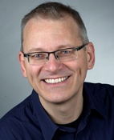

# Michael Scharf

Born 25-Apr-1961 in Heidelberg, Germany, married since '82, one daughter (born '86).

## The beginning of my career -- why Physics?

I have a **diploma in physics form the University of Heidelberg** and a passion for computing since I am 15. The reason
I studied physics
(starting '81) and not computer science was that I had such a strong interest in computing that I thought I would learn
it anyway. Physics was interesting because of its focus on fundamental principles and I hoped I would learn scientific
thinking.  **I have always been fascinated by the fact that our existence is based on a few "simple"
and elegant laws**. The urge to reduce complex system to a set of simple and composable parts has always been a driving
force in my life.

## 1986-1995 Computational Biology

From 1986-1995 I worked in the field of computational molecular biology at EMBL (European Lab for Molecular Biology).
The first 3.5 years I worked on my diploma thesis on protein structure prediction form protein sequences. Then worked as
scientific assistant.

### Years of exploration

During my time at EMBL I had a lot of freedom to experiment and explore new ideas and technologies. The team was
interdisciplinary
(biologists, chemists, physicists, mathematicians, computer scientists etc) and it was very exciting to have open
discussions with people with a wide range of experiences, views and insights. **I learned how important collaboration
and communication is, but also how important exploration and trial and error is.** I contributed lots of ideas,
**my boss [Chris Sander] often said "Michael creates many crazy ideas but one out of three is actually good".**

### ET++ and Erich Gamma

Around 1987-1988 I discovered on the internet a **C++ UI library called [ET++]**, which was written By [Erich Gamma] and
Andre Weinand (if you have read Erichs design pattern book ([GOF]), you'll find ET++ examples for most of the patterns).
I used ET++ as the basis for a lot of tools I wrote for visualization and analysis of molecular biological data. Since I
had access to Erichs PhD thesis and early drafts of the book, **I became an evangelist of design patterns and that way
of thinking.** I would sill say Erichs work has a fundamental impact on the way I look at software and the way I design
systems.

### Projects in work in a science context

Here are some of the projects I have been working on and and that I remember. Maybe what I remember and what I find
important in retrospect is telling something about me....

* 3d protein visualization in ET++ with lots of (at that time)
  new interactive capabilities
* query engine for a flat file protein database in gawk
* protein structure analysis tool in modula-2 (my diploma thesis)
* a very efficient object oriented implementation of a subset of Iris GL (which is the basis of OpenGL) in C for
  X-Windows
* 2d plotting (scatter plot) framework with direct links to data tables to show multidimensional data based on ET++ (was
  revolutionary in the 80ies)
* framework for generic remote proxies in python used to get local access to a database and analysis framework running
  on dedicated hardware
* fast algorithm to compare lots of (protein) sequences
* improved fastest existing algorithm for protein surface calculation by a factor of 10+
* a plotting "program" in postscript that scientists could appended to their data files and that printed nice graphs and
  plots
* automation of protein analysis - we reduced the manual effort of a man month work to a few hours calculations with 95%
  similar results (was later commercialised) in
  **perl and C++**
* using neural networks to improve protein sequence alignment

## 1994-2000 Contractor for TakeFive

**ET++ had a build-in IDE (Integrated Development Environment)** and a introspection system (because one of its
inspirations was Smalltalk). Walter Bischofberger extracted and expanded a stand-alone IDE called sniff. A small startup
company in Salzburg (Austria) named TakeFive commercialised sniff under the name SNiFF+. I joined them as contractor (
initially part-time) form my home office in Heidelberg. At that time I was one of the few ET++ experts and that made me
a natural fit.

### Collaboration as contractor working form a home office

Initially I did some classical contracting work (like enhancing the editor). **I also did customer training on the
product as well as on programming C++, python and on design patterns.**

Over time **I slipped more into the role of the lead developer.** That was quite interesting, because **I was the only
team member working remotely**. I was visiting the office regularly for 3-4 days every 4-6 weeks. When I was there we
had a lot of discussions on design and architecture. I had lots of one-on-one sessions when I was in the office, and I
often knew better than the "locals" who worked on what and who should talk to whom. Quite often, when I visited the
office next time, the white board was in the state I left it last time. **I learned that working in one office is not
sufficient to have good collaborations.**

When I was in my home-office I did implementation work on the SNiFF+ project. But I also did exploration work, trying
out new ideas and finding solutions or generalizations for problems that I have seen. Although lot of my code went
directly into the product, I preferred to work outside the current product stream to do forward looking,
next-generation-of-the-product work. **Many of the ideas and experiments I made failed. But lots of good ideas
emerged.** In many cases nobody asked me to look into a specific problem, but I used my senses to find areas where I
could make a difference, where I could create something that would add value for customers or something would enhance
the internal development.

### Freedom of a consultant

Being outside the day to day work of the team, I had a kind of Joker role that gave me some freedom to reflect on what
we were doing in terms of technology and architecture, but also in terms of management and the general direction of the
company. **As a consultant, I never had the official power to make decisions or direct people, but I gave advice to
decision makers and implanted ideas and had very good relationships to the developers in the team.**

Here are a few things I remember. The items in the list I designed, and did most of the implementation.

* a declarative, context based framework for views, command and menus (a kind of e4 for ET++)
* a DSL (domain specific language) and generator for python bindings to ET++ that encoded all the ownership rules of the
  not-garage collected C++-code -- this enabled a lot of extensions to SNiFF+ (mostly done by services)
* data driven tree-table implementation -- reduced time writing of a new tools form months to days
* [OQL] expression for (JSON like) data and tree/table filtering
* OQL implementation in python (never used in a product)
* python debugger with gdb like interface
* a distributed CORBA based implementation of the IDE (failed)
* rule based dialog model to separate the logic form the UI and to express logic declaratively
* pattern based parser for quick definition of syntax highlighting for programming languages
* lots of product contributions and enhancements including designing workflows and creating product enhancements

## 2000-2009 Contractor at Wind River

We (the TakeFive) team started creating an the *next generation SNiFF+ IDE written in Java* based on the learnings form
the last years. Around that time, TakeFive got acquired by Wind River and a cultural change started by merging teams
form different companies into one team. Wind River had (by acquisitions)five different IDEs with very different design
philosophies. It turned out to be very difficult, if not impossible, to merge "the best" of different cultures into a
single system. The company finally decided to use eclipse (which I was favoring).

**One key learning for me was that mixing different frameworks and styles can lead to more complex systems - it might be
better to use one consistent way of doing things, a set of principles everybody agrees on.** In that sense eclipse was a
good choice because it has its way of doing things (e.g. everything is a plug-in).

### Member of the Wind River architect team

**I became member of the Wind River cross-project architecture team.** One of the goals of the architect team was to **
cross-pollinate ideas between different teams and to facilitate the communication between teams.** There was a tendency
for teams to not see the impact of decisions for other teams. The IDE had to integrate with tools that were produced by
teams that have not been concerned with introperability with the IDE ("real men use command line tools and vi/emacs").
We also designed protocols and APIs for interacting components.

### Some projects I worked on

* wrote a generic reflective editor based on EMF [Eclipse Modeling Framework] using annotations. This allowed to replace
  150,000 lines hand written C++ code with 3,500 lines of EMF ([emfatic]).
* EMF based configuration modeling system which allowed to specify composable components (using the reflective editor
  with dynamic EMF models)
* designed a builder pattern for EMF models that allowed to simplify writing parsers for existing text based file
  formats
* designed APIs between the runtime and the IDE
* worked on the integration of existing command line tools into the IDE
* created "magic interfaces" a way to declare data structures as interfaces that can be bound to different storage
  formats, like IMemento, IConfigurationElement, IPreferenceStore, IDialogSettings ....
* designed a UI for [p2] (the eclipse installation and provisioning technology)
  based product installation application
* column oriented composable table abstraction
* fixed bugs and enhanced the architecture of one of the java based IDE frameworks and became eager to reduce code on
  each check-in - after one year I removed 36,000 lines of code - following the principle less is more
* efficient (vt100) terminal emulator for eclipse
* participated in a lot of the wind river workbench (C/C++ IDE based on eclipse CDT) design and architecture decisions
* worked on interaction design (Alan Cooper) and how this would make our products better
* developed the "What do I have to know to do the next step?"
  methodology for better usability (I should write a blog post on this topic...)
* educated teams on the benefits of domain driven design (DDD) - a reflection on specific challenges when writing tools
  for software developers...
* coaching and training of developers (by closely working together) - especially in model driven design

One of my colleges in the architect team used to say about me: **"Give Michael a problem to solve and he will find and
solve a more general problem."** (not sure if this is good or bad, but it reflects some truth about me)

## Since 2005 Member of the Eclipse Architecture Council

2005, I joined the [Eclipse Architecture Council]. I have given talks and tutorial (with others) on API design and
architecture on several Eclipse related conferences and meetings.

## 2009-2013 Employed as Principal Technologist at Wind River

Early 2009 I decided it is time to become an employee and **I became a member of the CTO office** reporting to the
CTO ([Tomas Evensen]). In addition to the role as architect, I spend most of my time on one CTO office project where we
created a runtime analysis system for embedded systems. Wind River had a set of independent analysis tools for different
operating systems using different technologies for instrumentation and target communication
(partly because they came for different acquisitions). Although it started as research project between me and another
Principal Technologist (Felix Burton), the decision was made quite early to use this as a pilot project for agile
development (and scrum in particular) with 8 people. This added a lot of non-technical challenges and I learned a lot
about the good and bad parts of agile.

On the technical side, **I was responsible for java part and the
(eclipse based) visualization** and (with Felix) for the overall architecture and design of the system. In that position
I had no management responsibilities but I did a lot of coding and pair programming with some of the members of the
team.

* co-designed a concise set of rules and operations for collecting and aggregating runtime data
* implemented a data processing engine for aggregating data - the engine was designed in multiple stages in different
  processes and on different systems (partly on the target, partly on the host)
* invented a value data structure that was a transactional, copy on write, delayed notification, efficient update,
  memory efficient and thread save (called IValue)
* configurable multistage data processing engine
  (interpreter pattern)
* template based configurable UI with DSL (Domain Specific Language)
  in [Xtext] with data binding to IValue which was (partly) driven by the incoming (meta) data
* code generator for several data aggregators that created C-code and virtual machine code
* extensible parser framework for a set of textual DSLs - allowed to plug in sub parsers in other DSLs

## Since Spring 2013: The Adventures of Web Development for a Startup Project

**Early 2013 it was time to leave Wind River and to go back to the roots of working on a start-up project.**

I started implementing a web application with a back-end in python/[Flask] and [elastic search]. The front end uses
google [Angular 1], [Bootstrap 2] and [CofeeScript] as the language. This involved a lot of learning new technologies.
For the first 18 months, I was mostly working alone on the project, I had to work on all aspects of the project,
including UI design (I had external some help with CSS), server setup, build process, bug fixing etc. It was a very
humbling experience to see all the little details necessary to create a product. I have a much better understanding of
the struggle of web developers and. I see lots of opportunities how better tooling, libraries and services to support
web developers.

The team has grown to 4 developers and we changed technologies. We switched to [Meteor] + [MongoDb], [React]
and [Bootstrap 3] started with Javascript but then choose to replace it with [TypeScipt], to be able to better deal with
changing requirements. We also use [mobx] for state management.

The key learning here is that web applications require a different set of (architectural) rules to be successful.

## Early 2017 till end 2019: Java Framework and IDE for dialogs for a database application

From January 2017 till end of 2019 I was consulting (1-2 days a week) a team that has a large Oracle Forms application
with lots of dialogs. The goal is to modernize the application and re-write the fornt end in Java using the [JVx] UI
framework. The Application has hundereds of dialogs and the team started writing them one by one using a UI builder that
generates Java code. In addition all the logic was written in Java. There is one additional requirement that makes the
hand-written code very complex:
there is demand for customer specific variants of dialogs.

In order to get more flexibility we designend a DSL to describe the layout of the dialogs. The DSL allows to modify
aspects of the UI similar to css style sheets. We added a rule engine for validation and for changing the UI depending
on data. We also added an IDE to edit the UI directly in the application to easily make customer specific dadaptations
of the UI (the DSL is interpreted at runtime, so changes do not requiere re-deployment of Java code). With this
approach, the UI became much more consistent, because the DLS interpreter creates encodes layout rules.

## Conclusions

As physicist, I always try to explain and build system with a minimal set of rules and principles. Like nature is based
on a few fundamental laws of physics, good software can by build and explained by a few fundamental architectural rules
and patterns.

One thing I have learned is that **creating simple systems is much harder than creating complex systems.** Once a simple
design has emerged it is hard for outsiders to understand how much pain and effort it is to reduce the complexity
because simple and elegant systems are
"obvious" once they are there.

There is no one size fits it all for architecture and design. Each system has its own risks and challenges that have to
be addressed by the architecture and frameworks used. To enhance and maintain a good architecture, each developer has to
understand enough of design and architecture of the system to make decisions that keep the integrity of the system. **
Without awareness and willingness to invest in architecture, systems very quickly degrade and become hard to maintain.**

Because what we do as developers has an impact on humans, I have a strong interest in sociology, psychology and the way
our sensing our perception, our thinking works.

**Software development is an inherent complex and social process.** The systems we create are a reflection of the
organizations and the people involved. **Excellent teams develop a set of common principles that are consistent and that
reduces complexity.** It does not matter too much what the principles are as long as they fit the system and they are
consistent.

My power unfolds when I am part of a team where I am in direct contact with the team members in an open communication.
My interest is to understand a system as a whole and to unfold and share the common vision with the team. **Most of my
career, I have seem myself as a technical team coach helping teams to discover the power and knowledge that enables us
to build great systems.**

In order to do that, it is important for me to continue developing code myself. I see software development is
a [craftsmanship] and
**my passion is to create well crafted software with learning teams of professionals to provide the best value for
customers**.

-----

[Chris Sander]: https://en.wikipedia.org/wiki/Chris_Sander_(scientist)

[ET++]: http://citeseerx.ist.psu.edu/viewdoc/summary;jsessionid=1A25D3F9BFB6E7EAC01C26E0ED656955?doi=10.1.1.33.4786 "Design and Implementation of ET++, a Seamless Object-Oriented Application Framework"

[Erich Gamma]: http://www.zdnet.com/blog/burnette/erich-gamma-a-pattern-of-success/134 "Erich Gamma: A pattern of success"

[GOF]: http://books.google.de/books/about/Design_Patterns.html?essenceId=iyIvGGp2550C&redir_esc=y "Ralph Johnson, Erich Gamma, John Vlissides, Richard Helm: Design Patterns: Elements of Reusable Object-Oriented Software"

[OQL]: http://www.cs.cornell.edu/home/ulfar/oodbms/ooqlang.html

[Eclipse Architecture Council]: https://wiki.eclipse.org/Architecture_Council

[Eclipse Modeling Framework]: http://www.eclipse.org/modeling/emf/

[emfatic]: https://wiki.eclipse.org/Emfatic

[p2]: https://www.eclipse.org/equinox/p2/

[Tomas Evensen]:https://www.linkedin.com/in/tomas-evensen-0783341

[Xtext]: https://www.eclipse.org/Xtext/

[elastic search]: https://www.elastic.co

[Meteor]: http://docs.meteor.com/#what-is-meteor

[TypeScipt]: https://en.wikipedia.org/wiki/TypeScript

[React]: https://facebook.github.io/react/

[Flask]: http://flask.pocoo.org

[MongoDb]: https://www.mongodb.com

[CofeeScript]: http://coffeescript.org

[Angular 1]: https://en.wikipedia.org/wiki/AngularJS#Angular_1

[Bootstrap 2]: http://getbootstrap.com/2.3.2/

[Bootstrap 3]: http://getbootstrap.com

[mobx]: https://mobx.js.org

[craftsmanship]: http://manifesto.softwarecraftsmanship.org

[JVx]: https://en.wikipedia.org/wiki/JVx_(Framework)